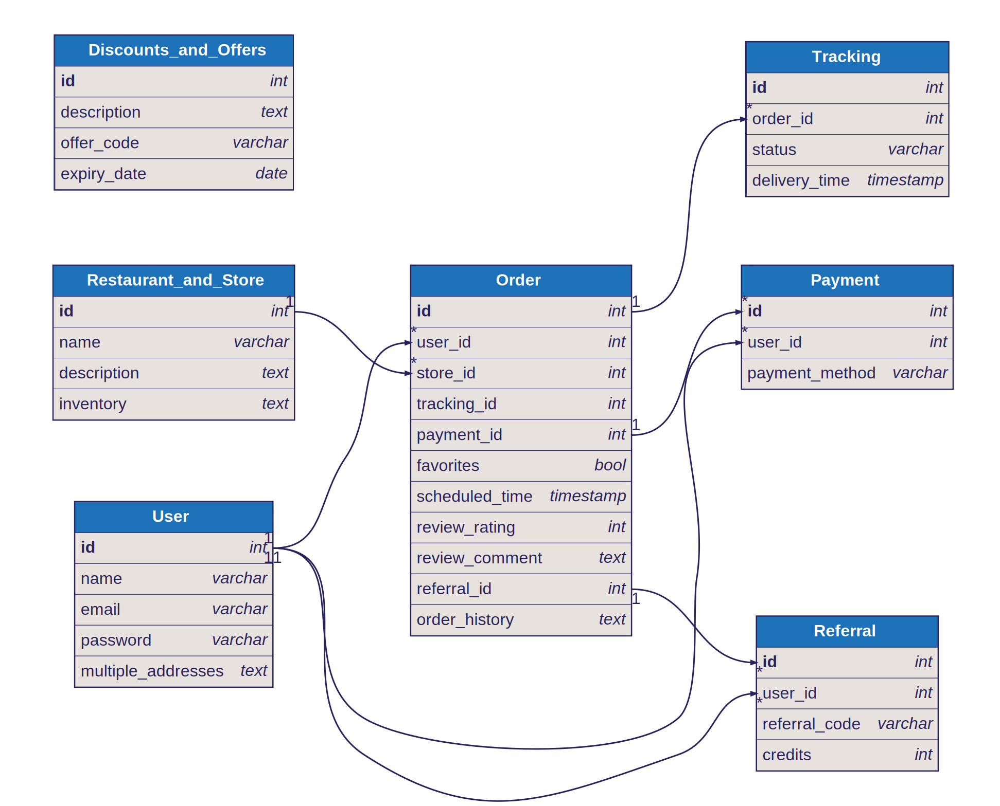
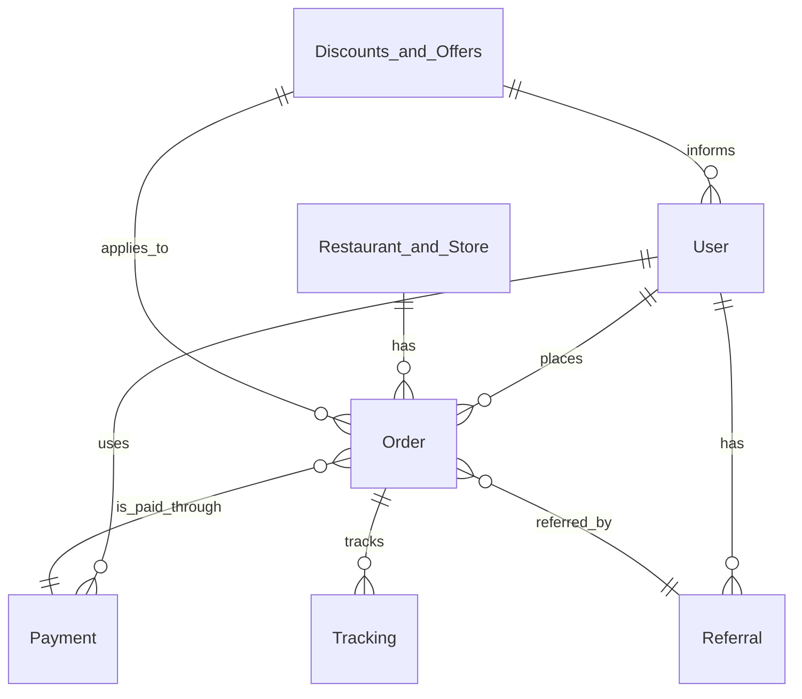

# Foodie-Person

Foodie-Person is a food delivery app that allows users to order food, groceries, and other items from local stores and have them delivered to their doorstep. It offers a wide range of restaurants and stores to choose from, making it easy for users to satisfy their cravings or get essential items without leaving their home.


## Project Capabilities
Foodie-Person offers the following capabilities:

- **Order Anything: From meals to groceries, electronics, and more** - This capability allows users to order a wide range of items from local stores and restaurants.
- **Real-Time Tracking: Know when your order will arrive, allowing you track your order from start to finish** - Real-time tracking gives users the ability to watch their order's journey from store to doorstep.
- **Scheduled Deliveries: Plan your deliveries for convenience** - Scheduled deliveries make it easy for users to plan around their availability.
- **Multiple Addresses: Save and switch between delivery locations** - This feature allows users to have orders delivered to different addresses, such as home, work, or a friend's house.
- **Favorites: Easily reorder from your preferred places** - The favorites feature allows users to save and easily reorder from their preferred spots.
- **Promotions: Enjoy special discounts and offers** - Promotions provide users with special discounts and offers, encouraging them to continue using the app.
- **Customer Support: Get help whenever you need it** - This ensures users have assistance available to resolve any issues they might encounter.
- **Multiple Payment Options: Pay with cash, credit card, or PayPal** - Multiple payment options make it easier for a user to pay in the manner most convenient for them.
- **Ratings and Reviews: Share your experience with other users** - Allows users to share their experiences and read reviews from other users.
- **Referrals: Invite friends to join Foodie-Person and earn credits** - This feature incentivizes users to invite their friends to join the app, boosting user acquisition.
- **Order History: View past orders and reorder with ease** - Order history lets users view and easily reorder from their past orders.


## Project Modules
Foodie-Person is composed of the following modules:

- **Inventory Management** - This module manages the items available for ordering from each restaurant or store.
- **Scheduling** - The scheduling module handles planned deliveries.
- **Payments** - This module handles payment processing for orders.
- **Notification** - The notification module informs users about important events, like order status changes.
- **Authentication** - This module handles user authentication, ensuring only authorized users have access.
- **Content Management** - Manages all content displayed within the app, such as restaurant/store info and promotions.
- **Order Management** - Handles the processing and tracking of orders.
- **Networking & Communication** - Ensures the app stays connected to the server, allowing for real-time updates.
- **Promotions** - Manages promotional codes and special offers.


## Detailed User Stories
Foodie-Person is composed of the following user stories:

### 
<details>
  <summary>Story 1: As a user, I want to be able to choose from a wide array of restaurants and grocery stores on the app</summary>

  - **Goal:** Boost the number of choices users have when ordering on the app
  - **Modules:** Authentication, Content Management, Inventory Management

  #### Workflow
  Step 1: User launches the app

Step 2: The 'Authentication' module handles user login or signup process

Step 3: Once authenticated, the 'Content Management' module generates and displays a vast selection of restaurants and grocery stores available for the user to choose from

Step 4: User selects their preferred restaurant or grocery store

Step 5: The 'Inventory Management' module retrieves and displays the items available from the selected restaurant or store

Step 6: User picks items to add to their shopping cart

Step 7: User confirms their order and proceeds to checkout

Step 8: User enters delivery address and preferred payment method

Step 9: Order is processed and a delivery driver is dispatched to pick up and deliver the order to the user's specified address 

Step 10: User is notified of the delivery progress until order is delivered to their doorstep
                    
  #### Sequence Diagram
  ```mermaid
    sequenceDiagram
User->>+App: Open App
App->>+Authentication: Authenticate User
Authentication-->>-User: User Authenticated
User->>+Content Management: Request for restaurants/grocery stores
Content Management-->>-User: Display available restaurants/grocery stores
User->>+Inventory Management: Select restaurant/store
Inventory Management-->>-User: Display available items
User->>App: Add items to cart and checkout
App->>Externals: Process payment and dispatch driver
Externals-->>-User: Notify User of progress until delivery
  ```
  
  #### Milestones
  
#### Milestone 1: User Authentication
- Develop the code to allow users to login to the app using their credentials

- Develop the code to allow new users to sign up for an account on the app


#### Milestone 2: Content Management
- Develop the code to fetch and display a wide selection of restaurants and grocery stores for the user to choose from


#### Milestone 3: Inventory Management
- Develop the code to fetch and display the items available from the selected restaurant or grocery store

- Develop the code to allow users to add items to their shopping cart


#### Milestone 4: Order Processing and Delivery
- Develop the code to allow users to confirm their order and proceed to checkout

- Develop the code to allow users to enter their delivery address and preferred payment method

- Develop the code to process the order and dispatch a delivery driver to pick up and deliver the order

- Implement the code to send notifications to the user regarding the progress of their delivery


                    

</details>


<details>
  <summary>Story 2: As a user, I want to track my food delivery in real time</summary>

  - **Goal:** Improve customer experience and provide peace of mind to users about their orders
  - **Modules:** Order Management, Notification

  #### Workflow
  1. User opens the food delivery app and logs in.
2. User places an order from a local store or restaurant using the 'Order Management' module.
3. After the order is placed, the system confirms the order and assigns a delivery person to it.
4. The 'Order Management' module updates the order status and location in real-time as the order is prepared, picked up, and during transit.
5. The 'Notification' module sends real-time updates to the user's device regarding the order status and location.
6. User can open the app anytime and track the order's current location and status.
7. After the delivery is completed, the 'Order Management' module updates the status to 'Delivered'.
8. The 'Notification' module sends a final update to the user announcing the completion of delivery.
                    
  #### Sequence Diagram
  ```mermaid
    sequenceDiagram
    participant User
    participant Order Management
    participant Notification
    User->>Order Management: Place Order
    Order Management-->>User: Confirm Order
    Order Management->>Notification: Send Order Confirmation Notification
    Order Management->>Notification: Send Real-Time Order Updates
    User->>Order Management: Track Order
    Order Management-->>User: Share Order Location and Status
    Order Management->>Notification: Send Order Delivered Notification
  ```
  
  #### Milestones
  
#### Milestone 1: User Authentication
- Implement user authentication functionality to allow users to log in to the food delivery app.


#### Milestone 2: Place Order
- Develop the Order Management module to enable users to place orders from local stores or restaurants.


#### Milestone 3: Real-time Order Tracking
- Integrate the Order Management module with real-time tracking functionality to update the order status and location as the order progresses.


#### Milestone 4: Notification Updates
- Develop the Notification module to send real-time updates to the user's device regarding the order status and location.


#### Milestone 5: Delivery Completion
- Update the order status to 'Delivered' in the Order Management module after the delivery is completed.

- Integrate the Notification module to send a final update to the user announcing the completion of delivery.


                    

</details>


<details>
  <summary>Story 3: As a user, I want to switch between multiple addresses for delivery</summary>

  - **Goal:** Provide flexibility to users who may be ordering from different locations
  - **Modules:** Authentication, Content Management

  #### Workflow
  1. The user Logs in through the 'Authentication' module.
2. User accesses account details through 'User account' module (not mentioned in the original story but necessary for address management).
3. User selects 'manage addresses' option under account details.
4. 'Content Management' module presents all previously saved addresses to the user.
5. User gets to either choose an already saved address or enter a new one.
6. After choosing the address, the Delivery module (not mentioned in the original story but necessary for delivery operations) kick-starts the delivery process to the selected address.
                    
  #### Sequence Diagram
  ```mermaid
    sequenceDiagram
    participant A as Authentication
    participant UA as User Account
    participant CM as Content Management
    participant D as Delivery

    Note right of A: User logs in
    A->>UA: Access account details
    UA->>CM: Retrieve saved addresses
    Note over CM: User can select an existing address or enter a new one
    CM-->>UA: User selects/enters address
    UA-->>D: Start delivery process
  ```
  
  #### Milestones
  
#### Milestone 1: Authentication
- Develop the functionality for users to register an account with the app

- Build the functionality for users to log in to their account


#### Milestone 2: User Account
- Create a user-friendly interface to display user account details

- Implement a feature to allow users to manage their delivery addresses


#### Milestone 3: Content Management
- Build the functionality to store and retrieve user addresses


#### Milestone 4: Delivery
- Integrate the address selection feature from the Content Management module into the Delivery module

- Develop the functionality to start the delivery process to the selected address


                    

</details>


<details>
  <summary>Story 4: As a user, I want to be informed about special discounts and offers</summary>

  - **Goal:** Increase user engagement and sales through promotions
  - **Modules:** Promotions, Notification

  #### Workflow
  1. Understand the promotions and discounts offered by the restaurants and stores. 
2. Develop code in the Promotions module to support different types of promotions such as sale, holiday specials, discounts, etc. 
3. Integrate the Promotions module with the main app so that it can display the current promotions on the app's homepage and relevant store pages. 
4. Implement a feature in the Promotions module to determine which users are eligible for the promotions. 
5. Develop code in the Notifications module to send push notifications about the promotions to eligible users. 
6. Integrate the Notifications module with the Promotions module to automate the process of sending notifications whenever a new promotion is available. 
7. Conduct thorough testing to ensure that notifications are sent accurately and on time, and that promotions are displayed correctly and can be used by users. 
8. Launch the feature for a small group of users to assess user engagement and sales impact. 
9. Based on the feedback and results, make any necessary adjustments and roll out the feature to all users.
                    
  #### Sequence Diagram
  ```mermaid
    sequenceDiagram
participant User
participant App
participant Promotions
participant Notifications

User->>App: Open App
App->>Promotions: Fetch promotions
Promotions-->>App: Send promotions
App-->>User: Display promotions
User->>App: Chooses a promotion

App->>Notifications: Trigger notification
Notifications-->>User: Send promotion notification
  ```
  
  #### Milestones
  
#### Milestone 1: Understand Promotions
- Research different types of promotions and discounts offered by restaurants and stores.


#### Milestone 2: Develop Promotions Module
- Identify different types of promotions such as sale, holiday specials, discounts, etc.

- Develop code to support different types of promotions in the Promotions module.


#### Milestone 3: Integrate Promotions Module
- Integrate the Promotions module with the main app to display current promotions on the app's homepage and relevant store pages.

- Implement a feature in the Promotions module to determine which users are eligible for the promotions.


#### Milestone 4: Develop Notifications Module
- Develop code in the Notifications module to send push notifications about the promotions to eligible users.


#### Milestone 5: Integrate Notifications Module
- Integrate the Notifications module with the Promotions module to automate the process of sending notifications whenever a new promotion is available.


#### Milestone 6: Testing and Launch
- Test the functionality of the promotions and notifications system to ensure notifications are sent accurately and on time, and promotions are displayed correctly.

- Release the promotions and notifications feature to a small group of users to assess user engagement and sales impact.


#### Milestone 7: Feedback and Adjustments
- Collect feedback from the small group of users to identify any issues or improvements needed.

- Based on the feedback and results, make any necessary adjustments to the promotions and notifications system.

- Roll out the promotions and notifications feature to all users after making the necessary adjustments.


                    

</details>


<details>
  <summary>Story 5: As a user, I want to be able to pay with my preferred payment method</summary>

  - **Goal:** Improve user experience by allowing flexible payment options
  - **Modules:** Payments

  #### Workflow
  1. Authenticate the user using the Authentication Module.
2. Retrieve list of available payment methods from the Payments Module.
3. Provide visual interface to display available payment methods and let user select their preferred option using the User Interface Module.
4. Upon selection, process payment using chosen method with integrations from the Payments Module.
5. Confirm payment processing, and provide feedback to the user using the Notifications Module.
                    
  #### Sequence Diagram
  ```mermaid
    sequenceDiagram
    User->>Authentication Module: Log in
    Authentication Module-->>User: Access granted
    User->>Payments Module: Retrieve payment methods
    Payments Module-->>User: Display payment methods
    User->>User Interface Module: Select Payment Method
    User Interface Module->>Payments Module: Process Payment
    Payments Module-->>Notifications Module: payment confirmation
    Notifications Module-->>User: Display Payment confirmation
  ```
  
  #### Milestones
  
#### Milestone 1: User Authentication
- Develop the Authentication Module to handle user authentication.


#### Milestone 2: Payment Methods
- Implement the Payments Module to retrieve and display available payment methods.


#### Milestone 3: User Interface
- Create a User Interface Module to provide a visual interface for users to select their preferred payment method.


#### Milestone 4: Payment Processing
- Integrate the chosen payment method from the Payments Module to process the payment.


#### Milestone 5: Notifications
- Implement the Notifications Module to provide feedback to the user after payment processing.


                    

</details>


<details>
  <summary>Story 6: As a user, I want to share my experience with other users through ratings and reviews</summary>

  - **Goal:** Improve the app's trustworthiness and credibility
  - **Modules:** Networking & Communication

  #### Workflow
  1. Identify the module 'Networking & Communication' to enable data transfer and interaction between the user and the food delivery app.
2. Use the identified module to create functionality for users to submit ratings and reviews for the food items and services they receive from the food delivery app.
3. The submitted reviews and ratings will be stored in the app's database.
4. Create a feature to display these reviews and ratings on the app, allowing other users to view them.
5. Finally, perform rigorous testing to ensure that the new feature works well, helping improve the app's trustworthiness and credibility.
                    
  #### Sequence Diagram
  ```mermaid
    sequenceDiagram
    participant User
    participant Networking & Communication
    participant Database
    participant App
    User->>+Networking & Communication: Submit rating & review
    Networking & Communication->>+Database: Store rating & review
    Database-->>-Networking & Communication: Confirm submission
    Networking & Communication-->>-User: Confirm submission
    App->>+Networking & Communication: Request rating & review
    Networking & Communication->>+Database: Retrieve rating & review
    Database-->>-Networking & Communication: Return rating & review
    Networking & Communication-->>-App: Display rating & review
  ```
  
  #### Milestones
  
#### Milestone 1: Enable User Reviews and Ratings
- Create a user interface where users can submit their reviews and ratings for the food items and services they receive

- Develop the backend functionality to store the submitted reviews and ratings in the app's database


#### Milestone 2: Display Reviews and Ratings
- Design a user interface to display the reviews and ratings received from users

- Develop the backend functionality to retrieve the stored reviews and ratings from the database

- Connect the UI components with the backend functionality to display the reviews and ratings on the app


#### Milestone 3: Testing and Refinement
- Perform testing to ensure that users can submit reviews and ratings successfully

- Test the functionality of displaying reviews and ratings on the app

- Make necessary improvements and optimizations based on testing results


                    

</details>


<details>
  <summary>Story 7: As a user, I want to earn credits by inviting friends to join Foodie-Person</summary>

  - **Goal:** Increase user base through referrals
  - **Modules:** Promotions, Networking & Communication

  #### Workflow
  1. User logs into the Foodie-Person App. 
2. User navigates to the Promotions module. 
3. User selects the 'Refer a Friend' option. 
4. The Networking & Communication module generates a unique referral link for the user. 
5. The App allows the user to share the referral link via various social media or messaging platforms. 
6. When a new user signs up using the referral link, the App tracks it back to the original sender. 
7. The App awards the user with the credits based on the successful referral and updates their account within the Promotions module. 
8. The user receives a notification of the earned credits.
                    
  #### Sequence Diagram
  ```mermaid
    sequenceDiagram 
        participant U as User 
        participant P as Promotions module 
        participant N as Networking & Communication module 
        U->>P: Access 'Refer a Friend' option 
        P->>N: Request to generate referral link 
        N-->>U: Provide referral link for sharing 
        Note over N,U: User shares the referral link 
        U->>P: New user signed up with referral link 
        P->>U: Award credits and update account 
        Note over U: User receives notification of earned credits
  ```
  
  #### Milestones
  
#### Milestone 1: User referral link generation
- Create a user login functionality

- Implement the Promotions module

- Develop the 'Refer a Friend' feature

- Generate a unique referral link for the user

- Allow users to share the referral link via social media or messaging platforms


#### Milestone 2: Tracking successful referrals
- Add user sign-up functionality

- Implement tracking of referral links

- Award credits to users for successful referrals

- Update user account within the Promotions module

- Send notification to users for earned credits


                    

</details>


<details>
  <summary>Story 8: As a user, I want to view and easily re-order from my order history</summary>

  - **Goal:** Improve user experience by simplifying the reordering process
  - **Modules:** Order Management

  #### Workflow
  Based on the user story and its goal, the steps for code development may include:
1. Authenticate User: Check if the user is signed in before they can access their order history.
2. Fetch Order History: Upon successful authentication, fetch the user's previous orders from the database.
3. Display Order History: Show the order history in a list view or grid view based on user preferences.
4. Select Order: Allow the user to select an order they want to reorder.
5. Re-Order: Populate the checkout form with the selected order details, allowing the user to change quantities if needed.
6. Submit Order: Submit the order for processing and payment. On successful payment, provide an order confirmation.
7. Update Order History: Finally, update the order history to include the new order for future reference.
8. Notify User: Send a confirmation notification to the user about their successful reorder.
                    
  #### Sequence Diagram
  ```mermaid
    sequenceDiagram
  participant User
  participant App
  participant Order Management
  User->>App: Sign In
  App->>Order Management: Authenticate User
  Order Management-->>App: Authentication Response
  App->>Order Management: Fetch Order History
  Order Management-->>App: Order History
  User->>App: Select Order to Re-Order
  App->>Order Management: Re-Order Request
  Order Management-->>App: Checkout Details
  User->>App: Confirm Order
  App->>Order Management: Submit Order
  Order Management-->>App: Order Confirmation
  App->>User: Display Confirmation and Update Order History
  ```
  
  #### Milestones
  
#### Milestone 1: Authenticate User
- Check if the user is signed in before they can access their order history.


#### Milestone 2: Fetch Order History and Display
- Fetch the user's previous orders from the database.

- Show the order history in a list view or grid view based on user preferences.


#### Milestone 3: Reorder
- Allow the user to select an order they want to reorder.

- Populate the checkout form with the selected order details, allowing the user to change quantities if needed.


#### Milestone 4: Submit Order
- Submit the order for processing and payment. On successful payment, provide an order confirmation.


#### Milestone 5: Update Order History and Notify User
- Update the order history to include the new order for future reference.

- Send a confirmation notification to the user about their successful reorder.


                    

</details>


  
## Project Models
Foodie-Person is composed of the following models:

- **User** - This represents the users of the app, storing their details and preferences.
- **Restaurant_and_Store** - Each restaurant or store is represented in this model, including their available inventory.
- **Order** - Each order a user makes is stored in this model, including details like tracking and payment info.
- **Payment** - This model stores the payment information for each order.
- **Tracking** - Each order's tracking information is stored in this model.
- **Referral** - The referral model stores the referrals made by the users to their friends.
- **Discounts_and_Offers** - This model holds the information about the ongoing promotions and discounts.

  
## Entity-Relationship Schema Diagram


## Entity-Relationship Diagram



